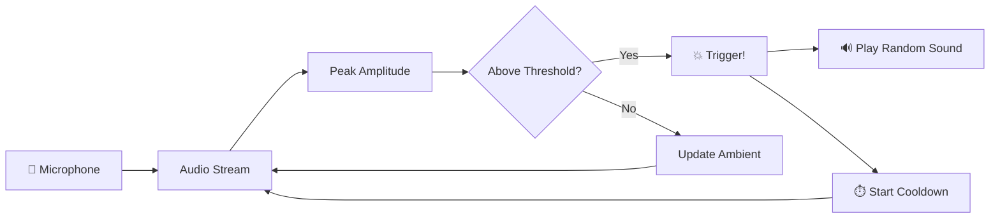

<p align="center">
  
</p>

<p align="center">
  
  
  
  
</p>

<p align="center">
  
  
  
</p>

---

<div align="center">

###  A real-time slap detection app for macOS that listens through your microphone, detects sharp impact sounds, and plays hilarious audio reactions.

*Built for Apple Silicon & Intel Macs and also windows  • Zero dependencies beyond Python • Fun party trick  *

</div>

---

##  Features

<table>
<tr>
<td width="50%">

### 🎤 Real-Time Audio Detection
Continuously monitors your MacBook's microphone at **44,100 Hz** with ultra-low latency (~23ms per block). Catches even the quickest slaps.

</td>
<td width="50%">

###  Live Visual Meter
```
🎤 [████████░░░░░░░░░░░░░░░░░░░░░░] peak=0.203
💥 SLAP DETECTED! Playing: smack_01.wav
```
Real-time audio level visualization right in your terminal.

</td>
</tr>
<tr>
<td width="50%">

###  Smart Adaptive Threshold
Uses an **exponential moving average** to learn ambient noise levels. Dynamically adjusts detection — works in quiet rooms AND noisy environments.

</td>
<td width="50%">

### 🎵 Random Sound Reactions
Drop `.mp3` or `.wav` files into the `audio/` folder (organized in subfolders!) and the app picks a **random reaction sound** on every slap.

</td>
</tr>
</table>

---

##  Quick Start

### Prerequisites

- **macOS** (Apple Silicon or Intel)
- **Python 3.9+**
- **Microphone permissions** granted to Terminal / your IDE

### Installation

```bash
# Clone the repo
git clone https://github.com/1sarthak7/slap-detection-mac.git
cd slap-detection-mac

# Create virtual environment
python3 -m venv .venv
source .venv/bin/activate

# Install dependencies
pip install sounddevice numpy
```

### Run

```bash
python slap.py
```

> **💡 First time?** macOS will ask for microphone permission. Click **Allow**, then restart the script.

---

##  Configuration

Fine-tune the detection by editing the top of `slap.py`:

| Parameter | Default | Description |
|:---|:---:|:---|
| `THRESHOLD` | `0.35` | Absolute peak amplitude threshold (0.0–1.0). Lower = more sensitive |
| `SPIKE_RATIO` | `3.0` | How many times louder than ambient a slap must be |
| `COOLDOWN` | `1.0` | Minimum seconds between consecutive triggers |
| `AMBIENT_DECAY` | `0.95` | Speed of ambient noise adaptation (higher = slower) |
| `SAMPLE_RATE` | `44100` | Audio sample rate in Hz |
| `BLOCK_SIZE` | `1024` | Samples per analysis block (~23ms) |

###  Tuning Tips

```
Too many false triggers? → Increase THRESHOLD or SPIKE_RATIO
Missing real slaps?     → Decrease THRESHOLD (try 0.15)
Double-triggering?      → Increase COOLDOWN (try 1.5)
Noisy environment?      → Increase SPIKE_RATIO (try 5.0)
```

---

##  Project Structure

```
slap-detection-mac/
├── 📄 slap.py              # Main detection engine
├── 📁 audio/               # Sound reaction files
│   ├── 📁 halo/            # Category: halo sounds
│   │   └── 🔊 *.wav/.mp3
│   ├── 📁 pain/            # Category: pain reactions
│   │   └── 🔊 *.wav/.mp3
│   └── 📁 sexy/            # Category: spicy reactions 😏
│       └── 🔊 *.wav/.mp3
├── 📄 README.md
└── 📁 .venv/               # Virtual environment (not committed)
```

---

##  How It Works



1. **Capture** — `sounddevice` streams audio from the microphone in real-time
2. **Analyze** — Each 23ms block is checked for peak amplitude using `numpy`
3. **Adapt** — An exponential moving average tracks ambient noise levels
4. **Detect** — A slap must exceed both the absolute threshold AND spike ratio
5. **React** — A random `.wav`/`.mp3` from the `audio/` folder is played via `afplay`
6. **Cooldown** — A configurable lockout prevents rapid re-triggering

---

## 🛠️ Troubleshooting

<details>
<summary><b> "No audio files found"</b></summary>

Make sure you have `.wav` or `.mp3` files inside the `audio/` folder or its subfolders:
```bash
ls -R audio/
```
</details>

<details>
<summary><b> Microphone not working / peak always 0.000</b></summary>

1. Go to **System Settings → Privacy & Security → Microphone**
2. Enable access for **Terminal** (or your IDE like VS Code)
3. Restart the script
</details>

<details>
<summary><b> ModuleNotFoundError: No module named 'sounddevice'</b></summary>

Make sure you activated the virtual environment:
```bash
source .venv/bin/activate
pip install sounddevice numpy
```
</details>

<details>
<summary><b> Too sensitive / not sensitive enough</b></summary>

Adjust `THRESHOLD` and `SPIKE_RATIO` in `slap.py`. Start with:
- Quiet room: `THRESHOLD = 0.15`, `SPIKE_RATIO = 3.0`
- Noisy room: `THRESHOLD = 0.40`, `SPIKE_RATIO = 5.0`
</details>

---

##  Contributing

<p align="center">
  <a href="https://github.com/1sarthak7/slap-detection-mac/issues">
    
  </a>
  <a href="https://github.com/1sarthak7/slap-detection-mac/issues">
    
  </a>
</p>

1. **Fork** the repo
2. **Create** a feature branch (`git checkout -b feat/amazing-feature`)
3. **Commit** your changes (`git commit -m 'Add amazing feature'`)
4. **Push** to the branch (`git push origin feat/amazing-feature`)
5. **Open** a Pull Request

---


<p align="center">
  
</p>

<p align="center">
  <a href="https://github.com/1sarthak7">
    
  </a>
</p>

<p align="center">
  ⭐ Star this repo if you enjoyed slapping your MacBook!
</p>
